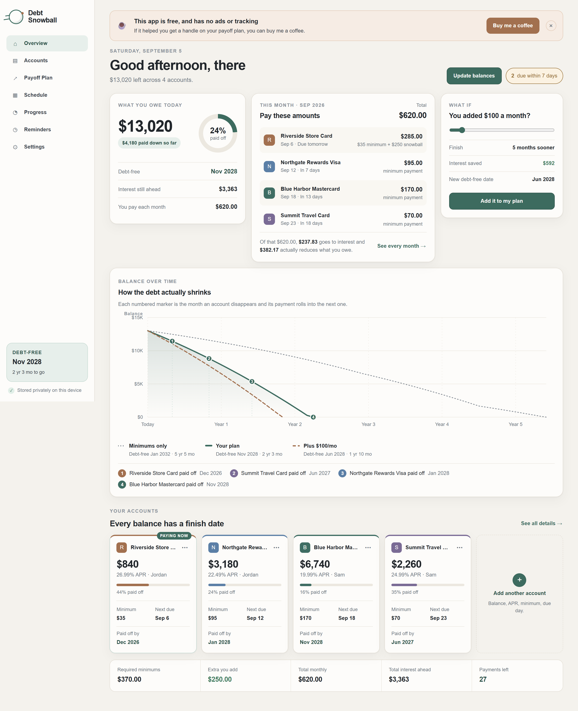
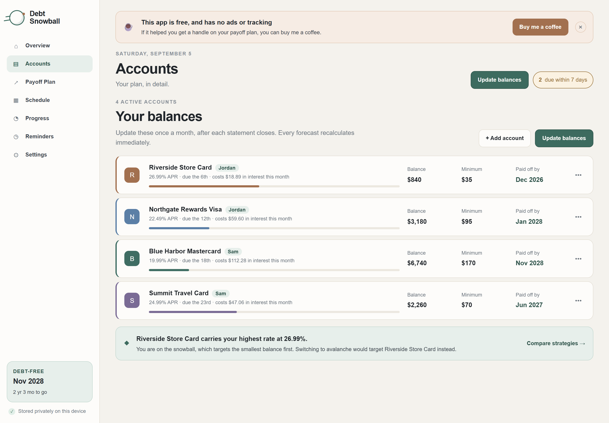
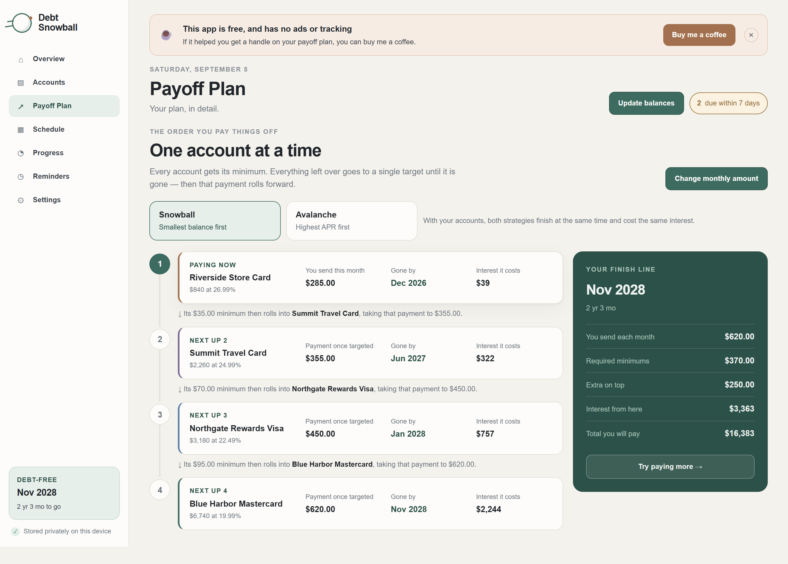
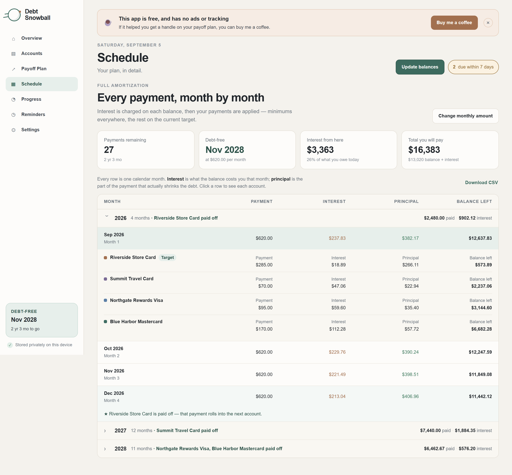
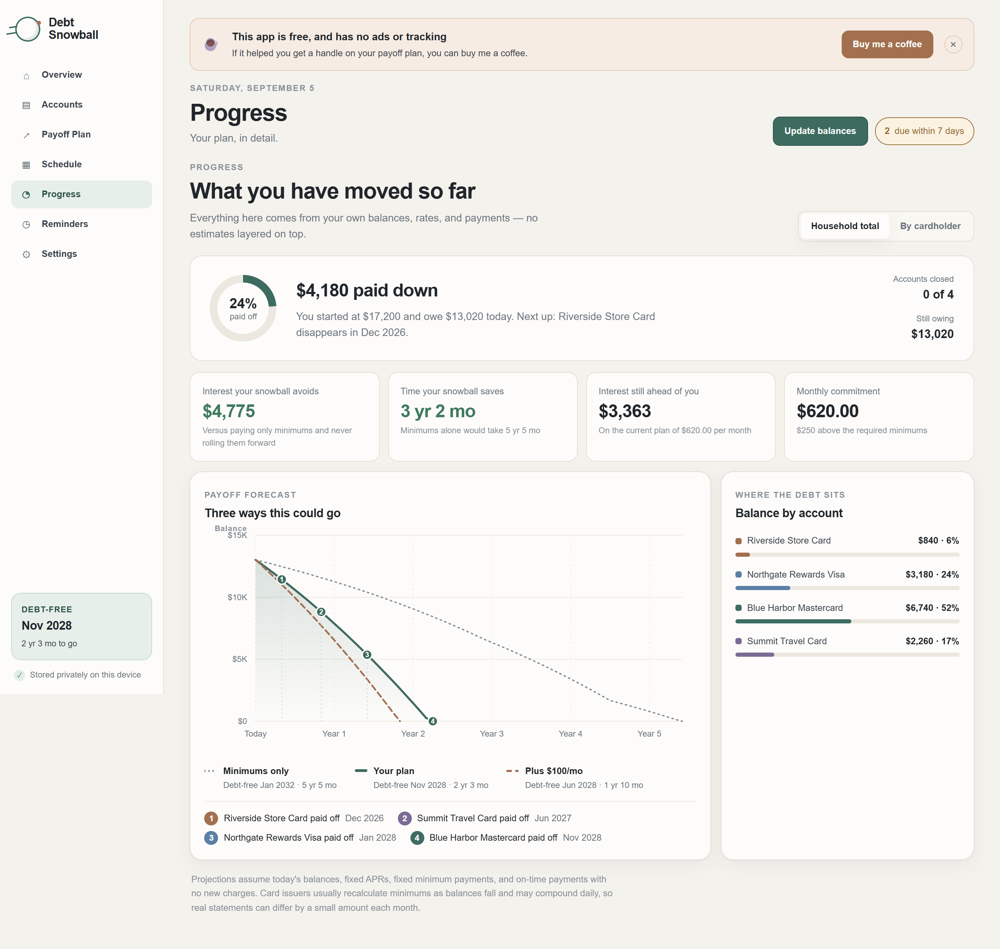
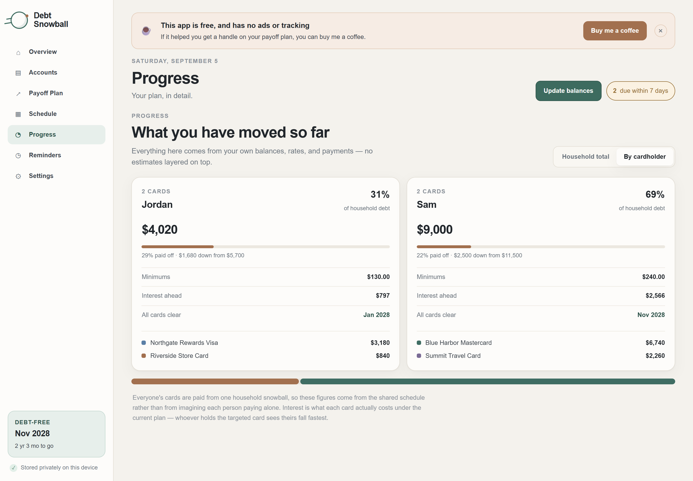
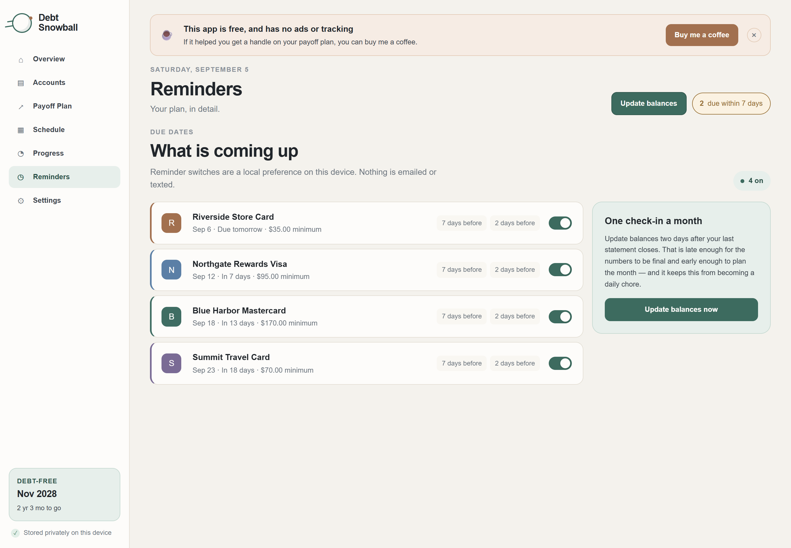
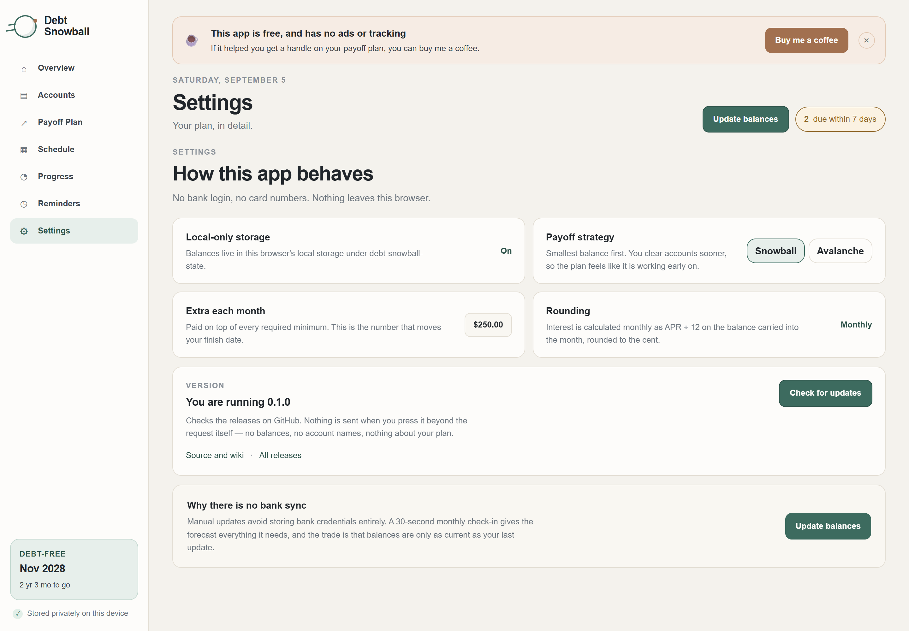

# Debt Snowball

**A private, offline-first payoff planner for credit-card debt.** Enter your
balances, rates, minimums and due dates, and it tells you exactly what to pay,
when to pay it, and the month you will finally be free.

No bank logins. No card numbers. No accounts, ads, analytics or telemetry.
Nothing about your money ever leaves your machine.

[](https://github.com/criso2hd-alt/debt-snowball/releases/latest)
[](https://buymeacoffee.com/criso2hdj)

> ### This app is free and always will be
>
> No ads, no subscription, no upsell, no data collection. If it helped you get a
> handle on your debt, **[buy me a coffee](https://buymeacoffee.com/criso2hdj)**.
> It is what keeps apps like this coming.

**[Read the Wiki](https://github.com/criso2hd-alt/debt-snowball/wiki)** for the
full guide, the maths behind it, and troubleshooting.

---



> Every figure in these screenshots comes from a fictional sample household.

**Take the tour:**
[Overview](#overview-what-to-do-this-month) ·
[Accounts](#accounts-your-balances) ·
[Payoff Plan](#payoff-plan-the-order-you-clear-them-in) ·
[Schedule](#schedule-the-full-amortization) ·
[Progress](#progress-what-you-have-moved) ·
[By cardholder](#progress-by-cardholder-for-households) ·
[Reminders](#reminders-due-dates) ·
[Settings](#settings-strategy-privacy-updates)

---

## What each part does

### Overview: what to do this month


The answer to *"what do I actually pay right now"*. Each account with its real
due date and the exact amount, ordered by which is due first, split into the
required minimum and the extra rolled on top. It shows how much of this month's
money is going to interest versus actually shrinking the debt.

Alongside it: what you owe today, the month you become debt-free, and a what-if
slider that reprices the whole plan as you drag it.

### Accounts: your balances



One row per card. Balance, APR, minimum, due date, what it costs you in interest
this month, and the month it disappears. Update these once a month after your
statements close and every forecast recalculates instantly.

### Payoff Plan: the order you clear them in



Every account gets its minimum. Everything left over attacks **one** target
until it is gone, and then that freed-up payment rolls into the next one. That
roll-forward is why the plan accelerates.

Switch between **Snowball** (smallest balance first, so wins arrive sooner) and
**Avalanche** (highest rate first, so you pay less interest). The app tells you
in plain English what the other order would cost or save, so it is an informed
choice rather than dogma.

### Schedule: the full amortization



Every single month until you are free, grouped by year. Expand any month to see
each account's payment split into **interest** (what the balance cost you) and
**principal** (what actually came off). Export the whole thing to CSV.

This is the screen that makes the cost of debt undeniable.

### Progress: what you have moved



How much you have paid down, what your snowball saves compared with drifting
along on minimums, and a forecast chart comparing three futures: minimums only,
your current plan, and paying a little more.

### Progress by cardholder: for households



If two people have cards, assign each card an owner and split every total per
person: cards held, balance, share of the household debt, minimums, interest,
and when that person's last card clears.

These figures come from the one shared household schedule, not from pretending
each person pays alone, because that is not what actually happens.

### Reminders: due dates



What is coming up and when, sorted by urgency. A missed payment costs a late fee
and can reset a promotional rate, which is the fastest way to undo months of
progress.

### Settings: strategy, privacy, updates



Switch strategy, adjust your monthly extra, and check for updates. It also
explains exactly where your data lives and why there is no bank sync.

---

## Why this exists

Debt is not just a number. It is the thing you think about at 2am. It is the
statement you do not open, the payment you are not sure cleared, the vague
certainty that you are losing ground without knowing how fast.

The cruelty of credit-card debt is that it is *designed* to be illegible. The
minimum payment on a $6,000 balance at 20% feels manageable at $170 a month. It
is not. That payment is roughly **$100 of interest and $70 of actual progress**.
Left on minimums, that single card takes decades and costs more in interest than
you originally borrowed. Nothing on the statement tells you this.

This app exists to make the number legible. Not to shame you, not to sell you a
consolidation loan, just to show you the truth and the shortest way out.

Seeing the whole thing written down is the part that helps. Once there is a date
on the calendar, the debt stops being a fog and becomes a schedule.

---

## Get it

### Desktop app (Windows and macOS)

**[Download the latest release](https://github.com/criso2hd-alt/debt-snowball/releases/latest)**

| File | For |
|---|---|
| `DebtSquasher.exe` | Windows |
| `DebtSquasher-macOS-arm64.tar.gz` | Mac, Apple Silicon |
| `DebtSquasher-macOS-x64.tar.gz` | Mac, Intel |

It runs a small password-protected server on your own machine and opens the
dashboard in your browser. Other devices on your home network can use it too.
Closing the app in the browser stops the server, so nothing lingers in the
background.

These builds are **not code-signed**, so Windows SmartScreen will warn you and
macOS needs the steps in [MAC_EXECUTABLE.md](MAC_EXECUTABLE.md). That is normal
for an independent build. If you would rather not trust a binary, build it
yourself in one command, since the source is all here.

### Or run it from source

```bash
npm ci
npm run dev
```

---

## Privacy

This is the part most budgeting apps get wrong, so to be explicit:

- **No bank connection.** Balances are typed in by hand.
- **No card numbers**, ever. The app has no field for one.
- **No account, no sign-up, no cloud.** There is nothing to breach.
- **No analytics, telemetry, crash reporting or ads.**
- Balances live in your browser's local storage, or in a local file on your own
  machine for the desktop builds.
- The support banner draws its own button instead of loading Buy Me a Coffee's
  image, so simply opening the app makes **zero** third-party requests.
- The only outbound request the app can ever make is the manual
  **Check for updates** button, which asks GitHub for a version number and
  sends nothing about you.

**If you use the desktop app's backup feature, the `DebtSquasherData.dat` it
writes contains your plan.** Keep it private and never ship it alongside the
executable.

---

## How the projections are calculated

`app/lib/plan.ts` builds one complete month-by-month schedule, and every figure
in the interface is read back out of it, so the headline numbers and the
schedule table can never disagree. Each month, in order:

1. Interest posts on the balance carried into the month at `APR / 12`.
2. Each account receives its required minimum.
3. Everything left over goes to the current target. When a target clears
   mid-month, the remainder spills to the next one.

The attack order is fixed once at the start rather than re-sorted each month, so
the target does not flip mid-payoff. Arithmetic runs in whole cents. A plan whose
payments cannot outpace its interest is reported as such rather than silently
truncated.

**Assumptions:** fixed minimums, fixed APRs, monthly compounding, on-time
payments, no new charges. Issuers usually recalculate minimums as balances fall
and many compound daily, so real statements can differ slightly month to month.
These are planning estimates, not lender statements.

`npm run test:plan` checks the engine against a closed-form amortization result
and verifies that total paid equals starting balance plus interest.

---

## Development

### Requirements

- Node.js 22.13 or newer, and npm
- Linux, WSL 2, or Git Bash for the shell-based lifecycle scripts

### Common commands

```bash
npm ci                  # install locked dependencies
npm run dev             # dev server
npm run lint            # eslint
npm test                # engine tests + build + worker smoke test
npm run test:plan       # calculation tests only (fast)
npm run test:local      # LAN server + app-lifecycle tests
npm run build:exe       # Windows executable  -> release/
npm run build:mac       # macOS packages      -> release/
npm run screenshots     # regenerate docs/screenshots from sample data
```

### Repository map

```text
app/lib/plan.ts                     Payoff engine: amortization, strategies, dates
app/lib/release.ts                  Version identity and the update check
app/components/TrajectoryChart.tsx  Balance-over-time chart
app/components/Schedule.tsx         Month-by-month amortization table
app/page.tsx                        State, account editing, views, interactions
app/globals.css                     Visual system, type scale, responsive rules
local-server/                       LAN executable server (auth, storage, lifecycle)
local-client/                       LAN executable client shell
worker/                             Cloudflare Worker entry point
scripts/                            Build, packaging, and screenshot helpers
tests/                              Engine, server, lifecycle, and render tests
```

### Technology

Next.js 16, React 19, TypeScript, Vinext and Vite, Cloudflare Workers runtime,
optional D1 through Drizzle. No component library: the interface is hand-written.

### Hosting notes

`.openai/hosting.json` associates a checkout with an OpenAI Sites project. It is
account-specific and **not tracked**, so it never appears in this repository.
Keep your local copy if you deploy to Sites. A clone without it builds normally
against empty bindings.

---

## Support

If this app saved you money, or just made the problem legible,
**[buy me a coffee](https://buymeacoffee.com/criso2hdj)**.

You can also star the repo, or open an
[issue](https://github.com/criso2hd-alt/debt-snowball/issues) with ideas and bugs.

---

## A note on the hard part

If your minimums alone are more than you can cover, this app will tell you
honestly that the plan does not close, and that is worth knowing rather than
discovering slowly. At that point the answer is not a spreadsheet, it is a
conversation. A non-profit credit counsellor can often negotiate rates in ways
an individual cannot, usually for free. In the US, look for a member agency of
the [NFCC](https://www.nfcc.org/).

Being in debt is not a character flaw. It is a very common, very solvable
arithmetic problem that the industry profits from keeping opaque.

## License

No open-source license has been selected. All rights are reserved unless a
license is added later.
